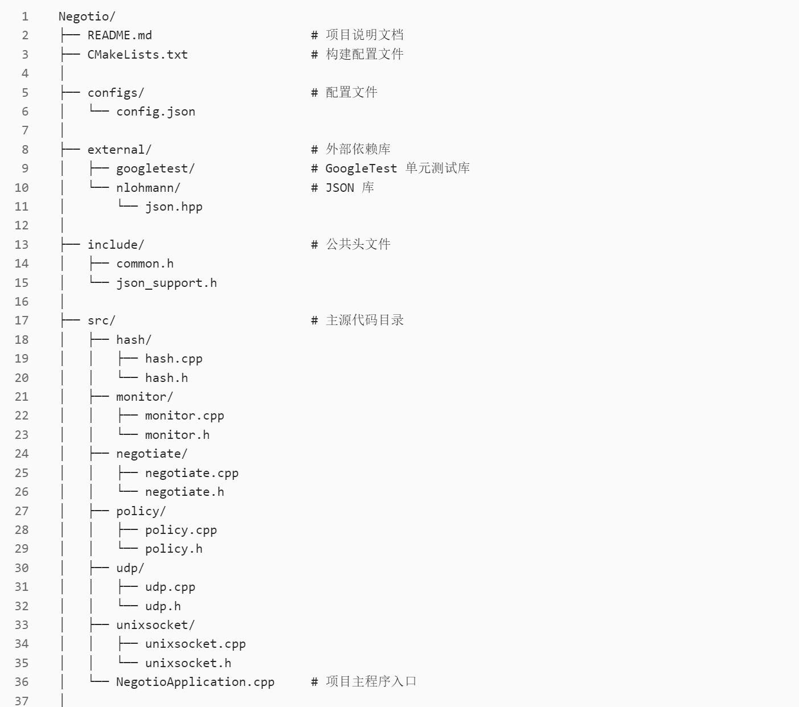
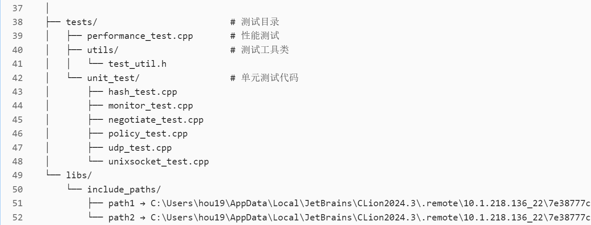

# Negotio

Negotio 是一个基于 UDP 协议和 Unix 套接字的协商程序。程序设计用于在严格的性能要求下实现协商过程，支持高并发策略管理，通过三包交互完成随机数交换并利用 SHA-256 算法生成公共密钥。

## 项目概述

- **协商协议**：三包交互
    - **第一包 & 第二包**：分别交换随机数。
    - **第三包**：确认包，收到随机数后使用 SHA-256 算法生成公共密钥。
- **数据传输**：
    - UDP 协议用于收发协商数据包。
    - Unix 套接字用于接收协商策略配置和控制命令。
- **性能要求**：
    - 协商延迟 ≤ 100ms
    - 支持最多 4096 条策略同时协商
    - 内存占用 ≤ 500M

## 编程语言选择

- **C++**：利用 C++ 的高性能和丰富的网络编程库，采用 CMake 进行跨平台构建，同时集成 GoogleTest 进行单元测试。

## 程序架构设计

- **模块划分**：
    - **udp**：实现 UDP 数据包的发送与接收。
    - **unixsocket**：通过 Unix 套接字接收策略配置和控制命令。
    - **negotiate**：实现协商逻辑，管理三包交互、随机数交换、确认流程及 SHA-256 公钥生成。
    - **hash**：封装 SHA-256 算法相关实现。
    - **policy**：管理协商策略，支持同时处理最多 4096 条策略。
    - **monitor**：监控性能指标，确保满足延迟和内存要求。

- **工程结构**：  
  工程目录结构清晰，将源码、测试、外部依赖和配置文件分门别类，便于维护与扩展。

## 文件树


## 开发环境与部署

- **开发平台**：Windows
- **远程构建环境**：Ubuntu 22.04.5 LTS (Jammy Jellyfish)
    - **连接方式**：
      ```bash
      ssh user3@10.1.218.136
      ```
    - **密码**：123456
- **IDE**：已在 CLion 中配置好远程 Linux 环境。
#### 注意：
     远程服务器位于学校实验室，有三种科学上网方式：
     - 1. 连接本校校园网（23点前）
     - 2. 连接实验室网络（全天，但仅限于设备位于实验室无线信号有效覆盖区域内）
     - 3. 使用 Tailscale 进行内网穿透
#### 或：自行使用其他 Linux 环境

## 构建与测试

### 构建项目

- 在 CLion 中打开项目，确保 `CMakeLists.txt` 配置正确。
- 使用 CLion 的远程构建功能进行编译。

### 单元测试

- 集成 GoogleTest，所有模块均有对应的单元测试代码，位于 `tests/unit_test/` 目录下。
- 运行单元测试以验证各模块功能的正确性。

### 性能测试

- 性能测试代码位于 `tests/performance_test.cpp`，用于验证协商延迟（≤ 100ms）、同时支持 4096 条策略协商以及内存占用（≤ 500M）的要求。

## 使用说明

### 策略配置

通过 Unix 套接字接收策略配置，示例命令如下：

```bash
echo '{"action": "add", "policy": {"policy_id": 1234, "remote_ip": "192.168.1.10", "remote_port": 5000, "timeout_ms": 100, "retry_times": 3}}' | socat - UNIX-CONNECT:/tmp/negotiation.sock
```
### 协商数据包交互

#### 第一包

生成并保存为 `packet1.hex`，转换为二进制后发送：

```bash
echo "4f47450e01000000d2040000000000000800000011111111111111111111111111111111111111111111111111111111111111111" > packet1.hex
xxd -r -p packet1.hex > packet1.bin
ls -l packet1.bin  # 应为 52 字节
socat - UDP-DATAGRAM:10.1.218.136:5000,sourceport=12345 < packet1.bin
```

#### 第二包
```bash
echo "4f47450e02000000d2040000000000000800000022222222222222222222222222222222222222222222222222222222222222222" > packet2.hex
xxd -r -p packet2.hex > packet2.bin
ls -l packet2.bin  # 应为 52 字节
socat - UDP-DATAGRAM:10.1.218.136:5000,sourceport=12345 < packet2.bin
```

#### 第二包
```bash
echo "4f47450e02000000d2040000000000000800000022222222222222222222222222222222222222222222222222222222222222222" > packet2.hex
xxd -r -p packet2.hex > packet2.bin
ls -l packet2.bin  # 应为 52 字节
socat - UDP-DATAGRAM:10.1.218.136:5000,sourceport=12345 < packet2.bin
```

#### 第三包
```bash
echo "4f47450e03000000d2040000000000000800000033333333333333333333333333333333333333333333333333333333333333333" > packet3.hex
xxd -r -p packet3.hex > packet3.bin
ls -l packet3.bin  # 应为 52 字节
socat - UDP-DATAGRAM:10.1.218.136:5000,sourceport=12345 < packet3.bin
```

#### 完整命令：
```bash
echo '{"action": "add", "policy": {"policy_id": 1234, "remote_ip": "192.168.1.10", "remote_port": 5000, "timeout_ms": 100, "retry_times": 3}}' | socat - UNIX-CONNECT:/tmp/negotiation.sock

echo "4f47450e01000000d2040000000000000800000011111111111111111111111111111111111111111111111111111111111111111" > packet1.hex

# 使用 xxd 将十六进制转换为二进制文件 packet1.bin
xxd -r -p packet1.hex > packet1.bin

# 检查文件大小（应为 52 字节）
ls -l packet1.bin

socat - UDP-DATAGRAM:10.1.218.136:5000,sourceport=12345 < packet1.bin

echo "4f47450e02000000d2040000000000000800000022222222222222222222222222222222222222222222222222222222222222222" > packet2.hex
xxd -r -p packet2.hex > packet2.bin
ls -l packet2.bin  # 确认大小为 52 字节

socat - UDP-DATAGRAM:10.1.218.136:5000,sourceport=12345 < packet2.bin

echo "4f47450e03000000d2040000000000000800000033333333333333333333333333333333333333333333333333333333333333333" > packet3.hex
xxd -r -p packet3.hex > packet3.bin
ls -l packet3.bin  # 确认大小为 52 字节

socat - UDP-DATAGRAM:10.1.218.136:5000,sourceport=12345 < packet3.bin
```


